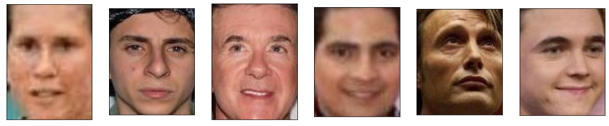
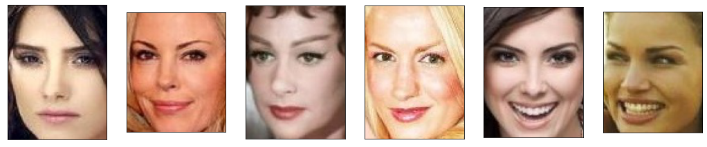

# Gender face swap ans style transfer Telegram Bot
> Bot is allowing people to do a gender face swap on their  photos, and the results are pretty hilarious or Use Style Transfer to bring real-time, Monet styles to your photo 

## Table of contents
* [General info](#general-info)
* [Technologies](#technologies)
* [Features](#features)
* [Examples of use](#examples-of-use)
* [Status](#status)
* [Inspiration](#inspiration)
* [Contact](#contact)

## General info
This is Telegram Bot project.Bot can:
* make style transfer image to Monet 
* swap gender on photo
* make style transfer from one image to another image

## Technologies
* heroku
* git-lfs - version 2.13.2
* Python - version 3.7
* aiogram - version 2.9.2
* Pillow - version 7.1.2
* numpy - version 1.19.0
* pytorch.torch - version 1.5
* pytorch.torchvision - version 0.6.1

## Code Examples
Show examples of usage:
`put-your-code-here`
https://github.com/raxod502/heroku-buildpack-git-lfs

## Features
List of features ready and TODOs for future development
* Bot token
* User Id
* Port

## Examples of use
* 1) Swap gender on photo
* swap man face to woman:
* original

* fake

or swap woman face to man:
* original

* fake

* 2)Make style transfer image to Monet 
* original

* fake

* 3)Make style transfer from one image to another image
* content_photo

* style_image

* result

## Status
Project is: _in progress_, (~~_finished_~~)

## Inspiration
Project inspired by:
* https://habr.com/ru/company/ods/blog/340154/
* Based on:
* https://github.com/junyanz/pytorch-CycleGAN-and-pix2pix
* https://www.kaggle.com/cashutosh/gender-classification-dataset
* https://github.com/alresin/Style_transfer_telegram_bot

## Contact
* Created by [@VasiliyTekhin](https://www.fartoviy109@gmail.com) - gmail
* @Konstanter - telegram
* Feel free to contact me!
